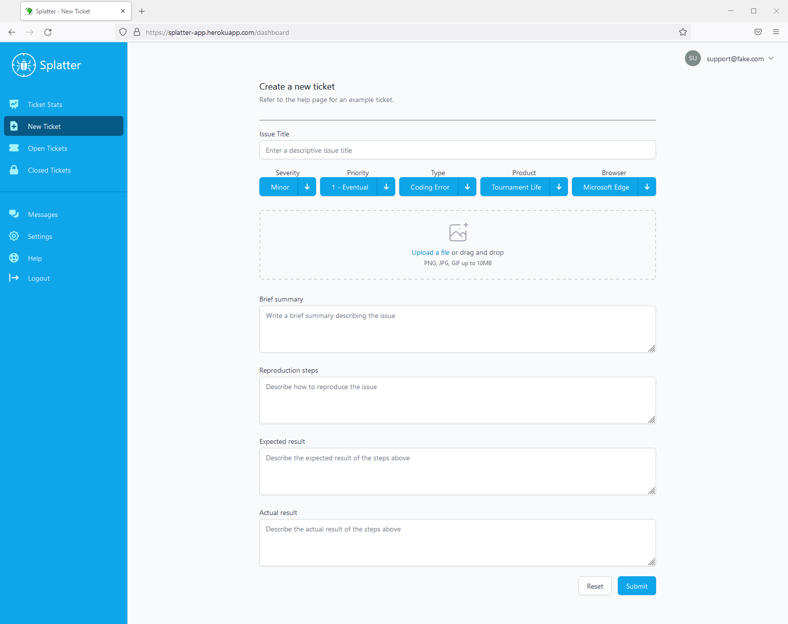

# Splatter

- **Purpose:** 
Splatter is an app designed to enable software development teams to easily track and catalogue bugs/issues 
during the software development process. Splatter utilizes a roles based authentication & authorization system
designed to be used by support staff, developers and admins.

### Live Link

<https://splatter-app.herokuapp.com//>

### Front End Stack
React, Html, Css, Redux, Recharts, React-Dropzone, TailwindCSS, HeadlessUI, HeroIcons

### Back End Stack
Apollo Server, Auth0, MongoDB, GraphQL, Websockets

### Landing Page

### New Ticket Creation Page

### Ticket View Page

